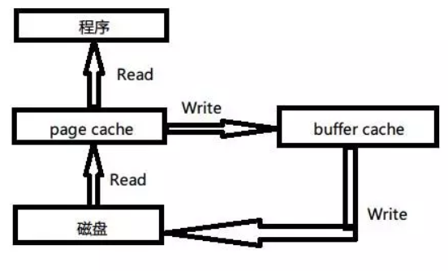

### linux free 命令下 free/available 区别

来直接看个例子：

```shell
[root@iZ2ze2twn5kzywegdzynssZ ~]# free 
              total        used        free      shared  buff/cache   available
Mem:        1883724      790760      195904        8516      897060      883680
Swap:             0           0           0
```

基本概念
 **第一列**
 `Mem` 内存的使用信息
 `Swap` 交换空间的使用信息
 **第一行**
 `total` 系统总的可用物理内存大小
 `used` 已被使用的物理内存大小
 `free` 还有多少物理内存可用
 `shared` 被共享使用的物理内存大小
 `buff/cache` 被 buffer 和 cache 使用的物理内存大小
 `available` 还可以被 **应用程序** 使用的物理内存大小

其中有两个概念需要注意

### free 与 available 的区别

`free` 是真正尚未被使用的物理内存数量。
`available` 是应用程序认为可用内存数量，`available = free + buffer + cache` (注：只是大概的计算方法)

Linux 为了提升读写性能，会消耗一部分内存资源缓存磁盘数据，对于内核来说，buffer 和 cache 其实都属于已经被使用的内存。但当应用程序申请内存时，如果 free 内存不够，内核就会回收 buffer 和 cache 的内存来满足应用程序的请求。这就是稍后要说明的 buffer 和 cache。

### buff 和 cache 的区别

从字面上和语义来看，buffer 名为缓冲，cache 名为缓存。我们知道各种硬件存在制作工艺上的差别，所以当两种硬件需要交互的时候，肯定会存在速度上的差异，而且只有交互双方都完成才可以各自处理别的其他事务。假如现在有两个需要交互的设备 A 和 B，A 设备用来交互的接口速率为 1000M/s，B 设备用来交互的接口速率为 500M/s，那他们彼此访问的时候都会出现以下两种情况：

- A 从 B 取一个 1000M 的文件结果需要 2s，本来需要 1s 就可以完成的工作，却还需要额外等待 1s,B 设备把剩余的 500M 找出来，等待 B 取出剩下 500M 的空闲时间内 (1s) ，A 其他的事务都干不了
- A 给 B 一个 1000M 的文件结果也需要 2s，本来需要也就 1s 就可以完成的工作，却由于 B 1s 内只能拿 500M，剩下的 500M 还得等下一个 1s B 来取，A 等待 1s 的时间内还做不了其他事务。

那有什么方法既可以让 A 在‘取’或‘给’B 的时候既能完成目标任务又不浪费那 1s 空闲等待时间去处理其他事务呢？我们知道产生这种结果主要是因为 B 跟不上 A 的节奏，但即使这样 A 也得必须等 B 处理完本次事务才能干其他活（单核 cpu 来说），除非你有三头六臂。

那有小伙伴可能会问了，能不能在 A 和 B 之间加一层区域比如说 ab，让 ab 既能跟上 A 的频率也会照顾 B 的感受，没错我们确实可以这样设计来磨合接口速率上的差异，你可以这样想象，在区域 ab 提供了两个交互接口一个是 a 接口另一个是 b 接口，a 接口的速率接近 A，b 接口的速率最少等于 B，然后我们把 ab 的 a 和 A 相连，ab 的 b 和 B 相连，ab 就像一座桥把 A 和 B 链接起来，并告知 A 和 B 通过他都能转发给对方，文件可以暂时存储。

对于第一种情况 A 要 B：当 A 从 B 取一个 1000M 的文件，他把需求告诉了 ab，接下来 ab 通过 b 和 B 进行文件传送，由于 B 本身的速率，传送第一次 ab 并没有什么卵用，对 A 来说不仅浪费了时间还浪费了感情，ab 这家伙很快感受到了 A 的不满，所以在第二次传送的时候，ab 背着 B 偷偷缓存了一个一模一样的文件，而且只要从 B 取东西，ab 都会缓存一个拷贝下来放在自己的大本营，如果下次 A 或者其他 C 来取 B 的东西，ab 直接就给 A 或 C 一个货真价实的赝品，然后把它通过 a 接口给了 A 或 C，由于 a 的速率相对接近 A 的接口速率，所以 A 觉得不错，为他省了时间，最终和 ab 的 a 成了好基友，说白了此时的 ab 提供的就是一种缓存能力，即 cache，绝对的走私！因为 C 取的是 A 执行的结果。所以在这种工作模式下，怎么取得的东西是最新的也是我们需要考虑的，一般就是清 cache。例如 cpu 读取内存数据，内存一般都从硬盘当中取出需要的数据作为缓存来增加系统的读取性能。

对于第二种情况 A 给 B：当 A 发给 B 一个 1000M 的文件，因为 A 知道通过 ab 的 a 接口就可以转交给 B，而且通过 a 接口要比通过 b 接口传送文件需要等待的时间更短，所以 1000M 通过 a 接口给了 ab ，站在 A 视图上他认为已经把 1000M 的文件给了 B，但对于 ab 并不立即交给 B，而是先缓存下来，除非 B 执行 sync 命令，即使 B 马上要，但由于 b 的接口速率最少大于 B 接口速率，所以也不会存在漏洞时间，但最终的结果是 A 节约了时间就可以干其他的事务，说白了就是推卸责任，哈哈。而 ab 此时提供的就是一种缓冲的能力，即 buffer，它存在的目的适用于当速度快的往速度慢的输出东西。例如内存的数据要写到磁盘，cpu 寄存器里的数据写到内存。

看了上面这个例子，那我们现在看一下在计算机领域，在处理磁盘 IO 读写的时候，cpu，memory，disk 基于这种模型给出的一个实例。我们先来一幅图：



page cache：文件系统层级的缓存，从磁盘里读取的内容存储到这里，这样程序读取磁盘内容就会非常快，比如使用 grep 和 find 等命令查找内容和文件时，第一次会慢很多，再次执行就快好多倍，几乎是瞬间。但如上所说，如果对文件的更新不关心，就没必要清 cache，否则如果要实施同步，必须要把内存空间中的 cache clean 下

buffer cache：磁盘等块设备的缓冲，内存的这一部分是要写入到磁盘里的。这种情况需要注意，位于内存 buffer 中的数据不是即时写入磁盘，而是系统空闲或者 buffer 达到一定大小统一写到磁盘中，所以断电易失，为了防止数据丢失所以我们最好正常关机或者多执行几次 sync 命令，让位于 buffer 上的数据立刻写到磁盘里。


